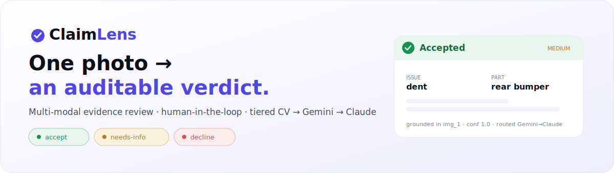
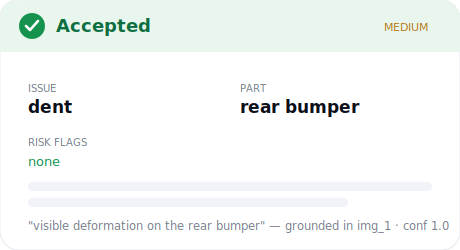
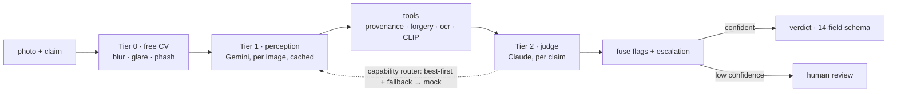

<div align="center">



# ClaimLens

**Turn one photo into an auditable `accept` / `decline` / `needs-info` verdict.**

A multi-modal **evidence-review agent** that verifies damage claims (car · laptop ·
package) from images + the claim conversation + user history — and **abstains to a
human** when it can't see enough. Built as a **tiered, human-in-the-loop harness**:
free deterministic CV → cheap VLM perception (Gemini) → a strong judge (Claude).


[Quickstart](#see-it-in-30-seconds) · [What it does](#what-it-does) · [Architecture](#architecture) · [Use it as a starter](#use-it-as-a-starter) · [Docs](#documentation)

</div>

> **Use this as a starter** if you're building **human-in-the-loop agents for claims,
> returns, warranty, or support** — anywhere a *photo is the source of truth* and a
> human should own the ambiguous calls. Fork it, point it at your data, swap the
> scenario packs, ship.

---

## See it in 30 seconds

```bash
python -m venv .venv && source .venv/bin/activate
pip install -r requirements.txt
python main.py            # runs the pipeline over the sample data → ./output.csv
```

No API keys? It still runs — every model tier falls back to a deterministic **mock**,
so the pipeline (and CI) always produce a valid, schema-conformant result. Add keys
(`GEMINI_API_KEY`, `ANTHROPIC_API_KEY` in `.env`) to use the real models.

> The bundled `dataset/` is a **tiny synthetic sample** (solid-color images, made-up
> labels) so it runs out-of-the-box — replace it with your own data in the same shape
> (see [`dataset/README.md`](./dataset/README.md)).

## Run the live assistant

```bash
pip install fastapi uvicorn
python server.py          # serves the chat PWA + the REAL pipeline at http://localhost:8000
```

A camera-only chat messenger: snap a photo, and the **same pipeline** that scores the
batch returns a grounded verdict card — issue, part, severity, risk flags, and a
justification — escalating to a human when it can't verify.

<p align="center"></p>

<sub>↑ the verdict card the assistant returns. Run `python server.py` for the live
messenger, and `python evaluation/main.py` → open `evaluation/dashboard.html` for the
eval dashboard. (Want real screenshots in this README? Drop PNGs into `assets/`.)</sub>

## What it does

| | |
|---|---|
| **Adjudicates, doesn't just detect** | Returns a *claim decision* (`supported` / `contradicted` / `not_enough_information`) with a grounded reason — not a bounding box. |
| **Abstains instead of guessing** | If the relevant part isn't visible it returns `not_enough_information` and routes to a human — the safe default for money decisions. |
| **Hard to game** | Camera-only capture + signed token, perceptual-hash reuse checks, in-image-text / prompt-injection detection, and a local CLIP object-consistency check. |
| **Cost is a dial** | Tiered cascade + content-hash cache + one strong-model call per claim; swap the judge (Claude ↔ Gemini) for an accuracy-vs-cost trade-off. |
| **Embeddable** | Emits a signed, versioned `ClaimReviewResult`; accepts a provider-agnostic `{claims, evidence, protocols}` intake from any chat/host. |

## Architecture



- **Schema-as-law, fail-closed:** every field is snapped to a legal enum; `claim_status`
  fails closed to `not_enough_information` (never fuzzy-matches toward "approve").
- **Capability router:** no hardcoded provider — picks the cheapest qualified model per
  tier and **falls back** (provider A → B → mock) so it never hard-fails.
- **Human-in-the-loop is first-class:** `manual_review_required` is an output, not an error.

Full design: [`docs/HLD.md`](./docs/HLD.md) · [`ARCHITECTURE.md`](./ARCHITECTURE.md) · the 12 [`docs/HARNESS_PRINCIPLES.md`](./docs/HARNESS_PRINCIPLES.md).

## Commands

| Goal | Command |
|---|---|
| Predictions over the data → `output.csv` | `python main.py` |
| Evaluate on labeled samples → report + dashboard | `python evaluation/main.py` |
| Live chat PWA + real pipeline | `python server.py` |
| Tests (hermetic, no keys) | `pytest tests/` |
| Lint / format | `ruff check . && ruff format --check .` |

## Use it as a starter

ClaimLens is structured so a new vertical is **config, not a rewrite**:

| Want to… | Do this |
|---|---|
| Add an object type / issue family | drop a YAML in [`evidence_review/scenario_packs/`](./evidence_review/scenario_packs/) — see [`docs/SCENARIOS.md`](./docs/SCENARIOS.md) |
| Add a detector (rule / model) | implement one `Tool` + register it — [`docs/TOOLS.md`](./docs/TOOLS.md) |
| Tune what auto-passes vs escalates | inject an `EscalationPolicy` — [`docs/INTEGRATION.md`](./docs/INTEGRATION.md) |
| Swap models / add a provider | one file in [`evidence_review/providers/`](./evidence_review/providers/) — [`docs/MODEL_ROUTING.md`](./docs/MODEL_ROUTING.md) |
| Submit a claim from any chat/host | the `{claims, evidence, protocols}` envelope — [`docs/EMBED.md`](./docs/EMBED.md) |
| Push verdicts into your stack | signed `ClaimReviewResult` + connectors — [`docs/INTEGRATIONS.md`](./docs/INTEGRATIONS.md) |
| Lock it down | input security + pluggable auth + injection defense — [`docs/SECURITY.md`](./docs/SECURITY.md), [`docs/PROMPT_INJECTION.md`](./docs/PROMPT_INJECTION.md) |

## Where it fits

Insurance FNOL · e-commerce returns ("arrived damaged / wrong item") · device &
warranty / RMA · logistics & parcel claims · large helpdesk/CMS queues. The pattern:
*verify the photo against the claim, auto-clear the clear-cut, escalate the rest.*

## Documentation

| Doc | Covers |
|---|---|
| [docs/HLD.md](./docs/HLD.md) | System context, components, request flows, contracts |
| [ARCHITECTURE.md](./ARCHITECTURE.md) | The three tiers, guardrails, context engineering, cost/scale |
| [docs/HARNESS_PRINCIPLES.md](./docs/HARNESS_PRINCIPLES.md) | The 12 principles of the extensible agent harness |
| [docs/EVALUATION.md](./docs/EVALUATION.md) · [docs/BENCHMARKING.md](./docs/BENCHMARKING.md) | Eval methodology + competitive positioning |
| [docs/SECURITY.md](./docs/SECURITY.md) · [docs/PROMPT_INJECTION.md](./docs/PROMPT_INJECTION.md) · [docs/GUARDRAILS.md](./docs/GUARDRAILS.md) | Untrusted-input security, injection defense, guardrails |
| [docs/EMBED.md](./docs/EMBED.md) · [docs/INTEGRATIONS.md](./docs/INTEGRATIONS.md) | Embeddable intake + the connector ecosystem |
| [docs/PRESENTATION.md](./docs/PRESENTATION.md) · [docs/deck.html](./docs/deck.html) | The full pitch + a self-contained slide deck |
| [docs/ROADMAP.md](./docs/ROADMAP.md) | Honest open items, by feature & priority |

## Honest limits

This began as a 24-hour hackathon build. Accuracy is **directional** (small labeled
set; selection-on-test — see [docs/EVALUATION.md](./docs/EVALUATION.md)); provenance is
integrity-only (no C2PA yet); named outbound connectors are documented scaffolds; the
included data is synthetic. The [roadmap](./docs/ROADMAP.md) tracks what to harden.

## License

[MIT](./LICENSE) © 2026 Anshuli Gupta. Built with a tiered Gemini + Claude harness.

> Pairs with the [Agent Groundwork](https://github.com/anshulixyz/agent-groundwork)
> playbook (how to build human-in-the-loop agents well) and the
> [Multi-Agent Loop Kit](https://github.com/anshulixyz/multi-agent-loop-kit).
</content>
