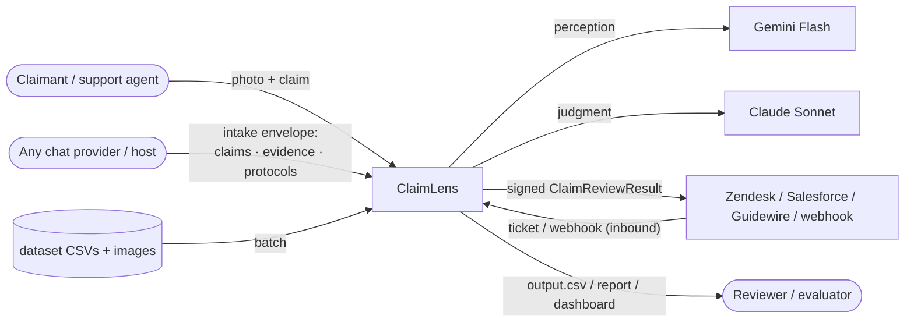
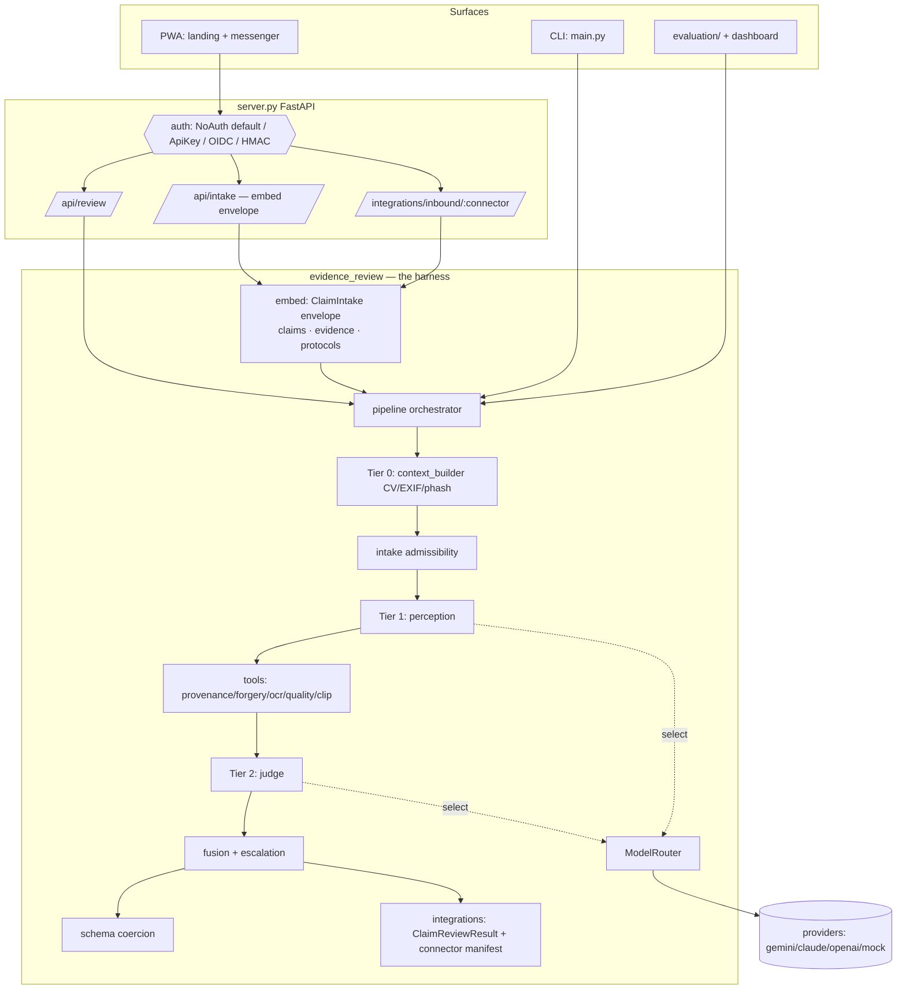
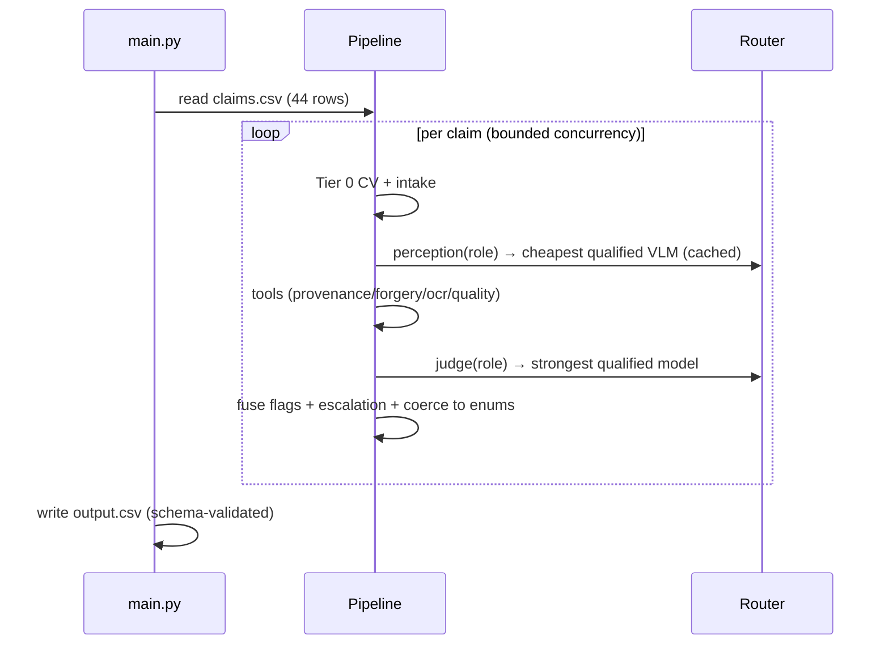
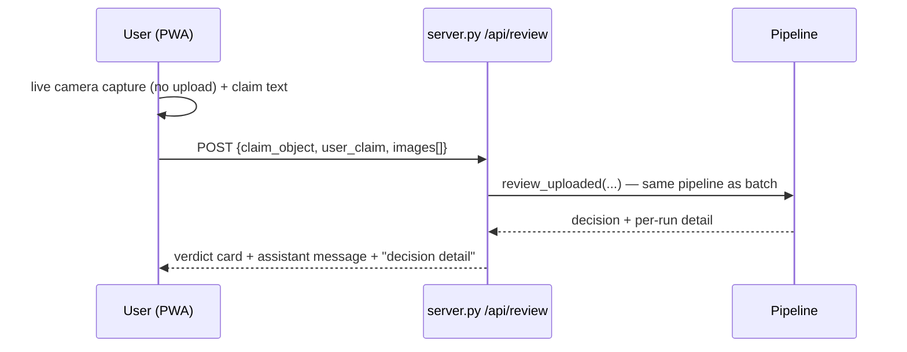
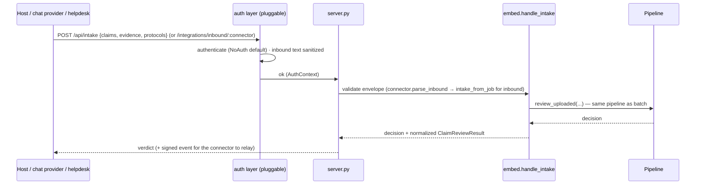

# ClaimLens — High-Level Design (HLD)

System-level view of the Multi-Modal Evidence Review system: context, components,
flows, contracts, and non-functional design. For the deeper design rationale see
[ARCHITECTURE.md](../ARCHITECTURE.md) and [HARNESS_PRINCIPLES.md](./HARNESS_PRINCIPLES.md);
for model selection see [MODEL_ROUTING.md](./MODEL_ROUTING.md).

---

## 1. Purpose & scope
Verify damage claims (car · laptop · package) from **images + a claim conversation
+ user history + minimum-evidence rules**, and return an auditable decision —
`supported` / `contradicted` / `not_enough_information` — with issue type, object
part, severity, risk flags, supporting image IDs, and a grounded justification.

**In scope:** the batch evaluation pipeline (`claims.csv → output.csv`), the
evaluation harness, a live conversational assistant, and an **embeddable intake
surface** so any chat provider / host can submit a claim and get a verdict.
**Pluggable but off by default:** an auth layer (API key / OAuth-OIDC / HMAC) and
named outbound connectors — documented as roadmap / scaffolds. **Out of scope:**
hosting itself (TLS/queue/scale belong to the deployment).

## 2. System context

ClaimLens is the orchestration + verification layer; it *consumes* model providers,
*accepts* claims from any host through a provider-agnostic envelope (gated by a
pluggable auth layer), and *emits* verdicts into the customer's stack. The image is
the source of truth.

## 3. High-level architecture

## 4. Components

| Component | Responsibility | Key files |
|---|---|---|
| **Surfaces** | CLI batch, FastAPI server, PWA messenger, eval/dashboard | `main.py`, `server.py`, `pwa/`, `evaluation/` |
| **Pipeline orchestrator** | Run the per-claim DAG; bounded concurrency | `pipeline.py` |
| **Tier 0 — context builder** | Deterministic CV: blur/exposure/glare, EXIF, perceptual-hash reuse | `context_builder.py` |
| **Intake** | Admissibility protocol + input security (format/size/traversal) | `intake.py` |
| **Tier 1 — perception** | Per-image VLM evidence, content-hash cached | `perception.py` |
| **Tools** | Independent detectors → risk flags + evidence | `tools/`, `harness/registry.py` |
| **Tier 2 — judge** | Calibrated 14-field decision over assembled context | `judge.py`, `prompts.py` |
| **Model router** | Capability-based model selection + qualification + fallback | `router.py` |
| **Fusion + escalation** | Union deterministic flags; human-in-the-loop policy | `pipeline._fuse`, `harness/escalation.py` |
| **Schema** | Output columns + enums + coercion (the contract) | `schema.py` |
| **Integrations** | Signed `ClaimReviewResult` + connector registry & capability manifest; reference inbound parse (Zendesk) | `integrations.py` |
| **Embed surface** | Provider-agnostic `ClaimIntake` envelope (claims · evidence · protocols) → same verdict as batch | `embed.py`, `server.py` `/api/intake` |
| **Auth (pluggable)** | `NoAuth` default / ApiKey / OIDC / HMAC dependency on `/api/*`; inbound text sanitizer | `harness/auth.py`, `harness/sanitize.py` |
| **Observability** | Per-claim trace, usage/cost tracking | `harness/trace.py`, `usage.py` |

## 5. Primary flows

### 5.1 Batch (evaluable submission)

### 5.2 Live chat (assistant)

### 5.3 Embed / inbound (any host or helpdesk)

## 6. Data & contracts
- **Input** (`claims.csv`): `user_id, image_paths(;), user_claim, claim_object`.
- **Output** (`output.csv`): the 14 fixed columns + allowed-value enums (`schema.OUTPUT_COLUMNS`); every model field is **snapped to a legal value** (fails closed).
- **Event** (`ClaimReviewResult`): versioned, HMAC-signed; the integration contract.
- **Capture token**: HMAC over canonical JSON binding `sha256(image)` + provenance (PWA ⇄ `capture_token.py`, verified both ways).

## 7. Model routing (capability + fallback)
No hardcoded provider. A model qualifies for a role only if its declared
capabilities ⊇ the role's requirements; the router ranks qualified models
(perception=cheapest, judge=strongest), tries best-first, and **falls back** on
permanent failure (credit/auth) via a per-run circuit-breaker, with `mock` as the
final backstop. → [MODEL_ROUTING.md](./MODEL_ROUTING.md).

## 8. Cross-cutting / non-functional

| Concern | Design |
|---|---|
| **Cost** | Tiering (free CV → cheap perception → one strong judge/claim); content-hash cache → re-runs ~free; inadmissible images skip model calls; **confidence-gated short-circuit** skips the expensive judge on unusable / wrong-object claims (CLIP runs locally, free). |
| **Latency** | Bounded thread pool (`MAX_CONCURRENCY`); compact JSON to the judge, not raw images. |
| **Reliability** | Provider retry-with-backoff (transient 5xx/429); router fallback + circuit-breaker; per-claim errors isolate to a `manual_review_required` row; mock backstop. |
| **Security** | Path-traversal guard, decompression-bomb/format caps, layered prompt-injection defense (instruction hierarchy + spotlighting + text/image guards), fail-closed coercion, pluggable auth (off by default), secrets from env only. → [SECURITY.md](./SECURITY.md), [PROMPT_INJECTION.md](./PROMPT_INJECTION.md) |
| **Observability** | Per-claim structured trace; usage/cost per tier; eval dashboard. |
| **Extensibility** | Tools, scenario packs (YAML), intake checks, escalation policy, providers, connectors — all pluggable. → [INTEGRATION.md](./INTEGRATION.md) |
| **Reproducibility** | `temperature=0`, enum snapping, content-hash cache, deterministic mock tier (runs with no keys). |

## 9. Deployment topology
- **Local CLI** — `python code/main.py` → `output.csv` (the graded artifact).
- **Localhost server** — `python code/server.py` serves the PWA + `/api/review` (the live assistant); nextmillionai's one-server pattern.
- **Future hosted** — the server behind TLS/auth + a job queue; capture-token attestation (server nonce + Play Integrity / App Attest); live connectors. → roadmap in [BENCHMARKING.md](./BENCHMARKING.md).

## 10. Key design decisions & trade-offs (why we chose what)

Guiding principle: **spend free/cheap deterministic work first; reserve the
expensive model for genuine judgment.** Every choice below follows from that.

| Decision | Why we chose it | Alternative rejected | Trade-off |
|---|---|---|---|
| **Tiered cascade** (free CV → cheap VLM perception → strong judge) | Cost + quality: the priciest model runs once per claim, over distilled evidence, not raw pixels | One frontier VLM per claim (simpler but costly + harder to audit) | More moving parts |
| **Gemini Flash-Lite perceive + Claude Sonnet judge** | Cheapest *capable* model at each tier; per-image work is ~10–30× cheaper, the hard reasoning gets the strong model | Same model for both (over-pay perception or under-power judgment) | Two providers to manage (the router handles it) |
| **Capability `ModelRouter` (qualify + fallback), not LangGraph** | Our flow is a fixed DAG, not a ReAct loop; the harness blog's "start simple / harness is the engineering". Routing/fallback is the *actual* need — and the thing that survived the live Claude-credit outage | LangGraph rewrite (ceremony for no behavioural gain here) | No graph-framework features (added only if real agent loops appear) |
| **CLIP object-consistency as a LIVE cheap verifier** | Independent, non-VLM anti-gaming signal (catches wrong-object the VLM may miss); runs locally on CPU, **free, zero tokens** | Trusting the VLM alone for object identity; or a heavy GPU detector | One extra dependency (torch); conservatively thresholded to avoid false positives |
| **Confidence-gated short-circuit** (skip judge on unusable / two-signal wrong-object) | Realises the cost goal: the strong model runs only when there's a real decision; cuts the priciest call on junk/gaming | Always calling the judge | Must be conservative — gated so it fires **0×** on genuine claims (accuracy preserved) |
| **Images are source of truth; abstain when the part isn't visible** | Never approve on the user's words; `not_enough_information` is the safe default for money decisions | Forcing a supported/contradicted call | More `not_enough_information` outcomes |
| **Schema-as-law + fail-closed coercion** | The grader checks exact columns/enums; a model can't emit an illegal value or fuzzy-match toward "approved" | Trusting model output formatting | A little defensive code |
| **Deterministic fusion of tool flags** | Rules keep the model honest — a tool-asserted flag (reuse, in-image text) can't be silently dropped | Letting the judge own all flags | Slightly more conservative flagging |
| **Mock fallback tier** | Keyless reproducibility + hermetic CI; the system always emits a valid row | Hard-failing without keys | Mock output is heuristic, clearly labelled |
| **Vendored React, no build step (PWA)** | Boots offline / on locked-down networks; demoable with one server, no toolchain | CDN React (white-screen offline) or a full build pipeline | Manual dependency vendoring |
| **Client-side capture token (demo)** | Demonstrates the byte↔payload binding without a server | Claiming full provenance now | Integrity-only until server-issued nonce + platform attestation |

## 11. Risks & limitations
Small labelled set (n=20) → metrics directional; ELA is a weak forensic prior;
EXIF provenance is forgeable (C2PA is the hard signal); named connectors are
scaffolds; chat verdict needs the local server running. Mitigations + roadmap:
[REVIEW.md](./REVIEW.md), [BENCHMARKING.md](./BENCHMARKING.md).
